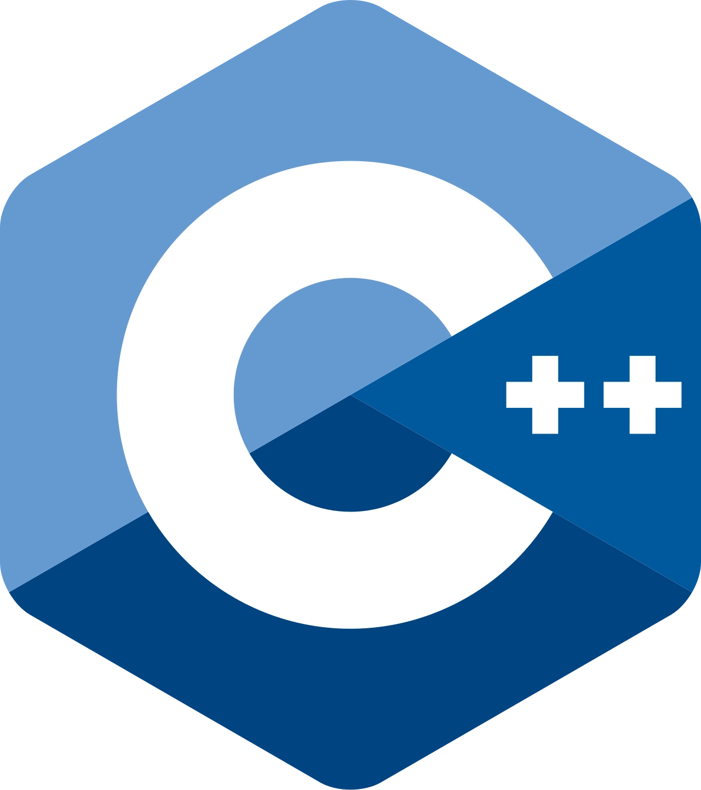
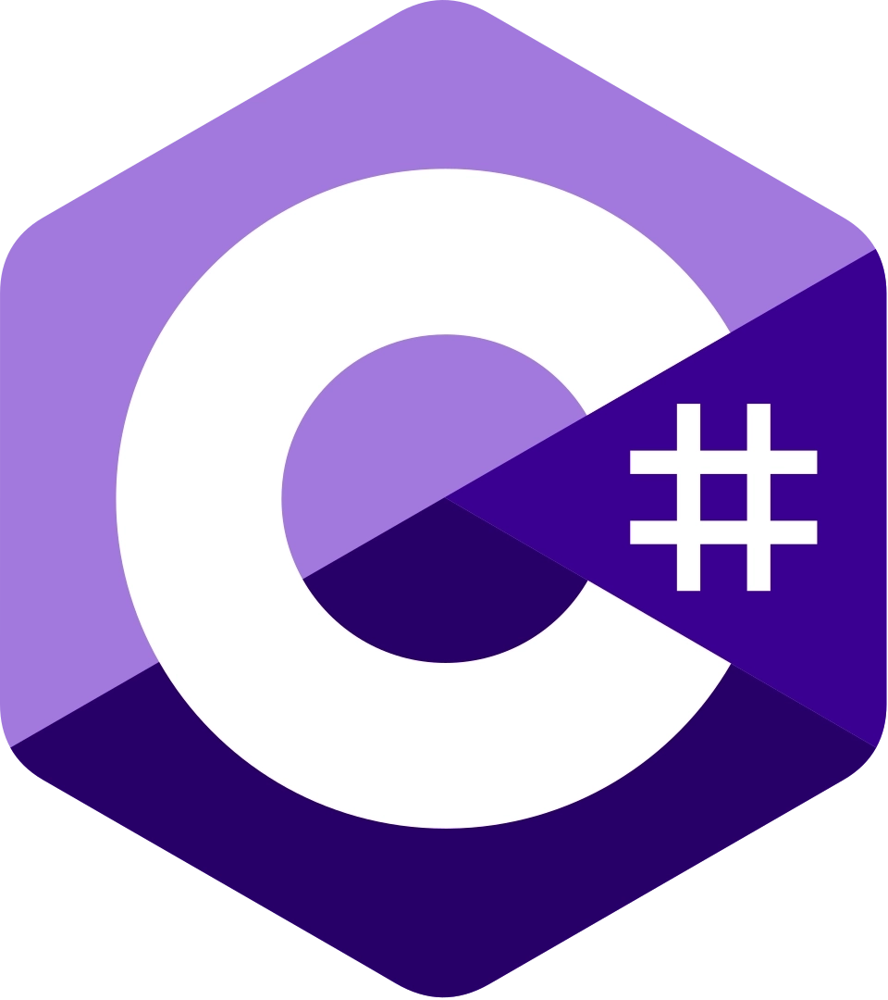

    

## 💡 About Me

- I like playing the piano
- A fun fact: I can perform the Hopak dance
- Ask me anything via inbox or email

## 🔗 I'm available on:

  
  
  
  
    

## 🛠️ Tech Stack

  
  
  
    
  
  
   
  
  
   
   
  
  
   

## 📊 GitHub Stats

<table style="width:100%; border-collapse:separate; border-spacing:12px;">
  <tr>
    <td valign="center" width="50%" style="padding:6px;">
      
    </td>
    <td valign="top" width="39%" style="padding:6px;">
      
    </td>
  </tr>
</table>
<table style="width:100%; border-collapse:separate; border-spacing:12px;">
  <tr>
    <td valign="top" width="100%" style="padding:6px;">
        
    </td>
  </tr>
</table>

